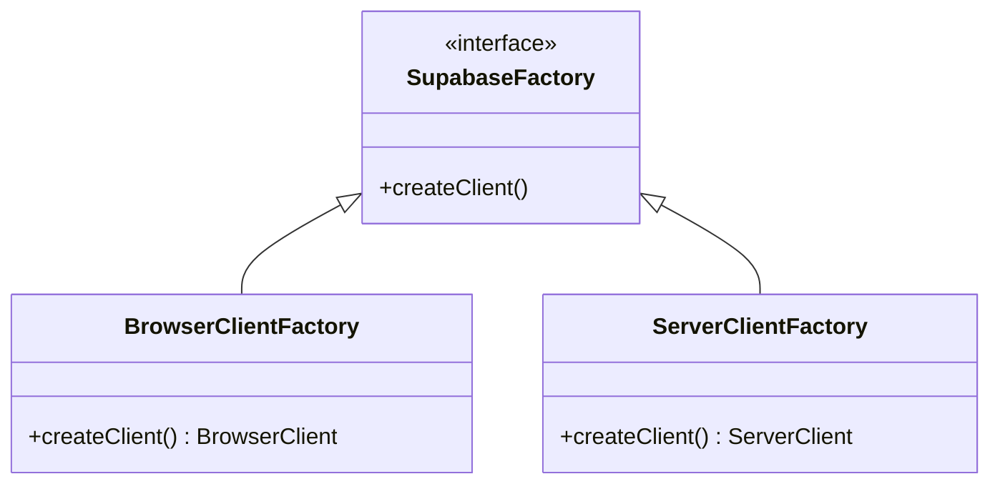
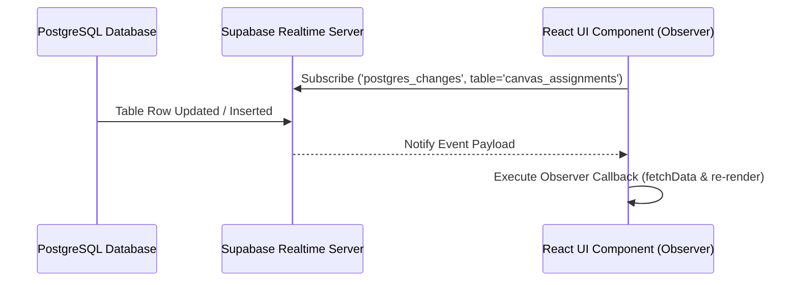
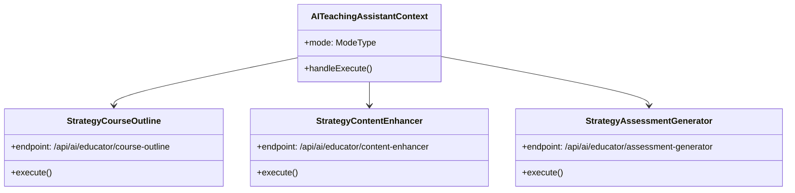
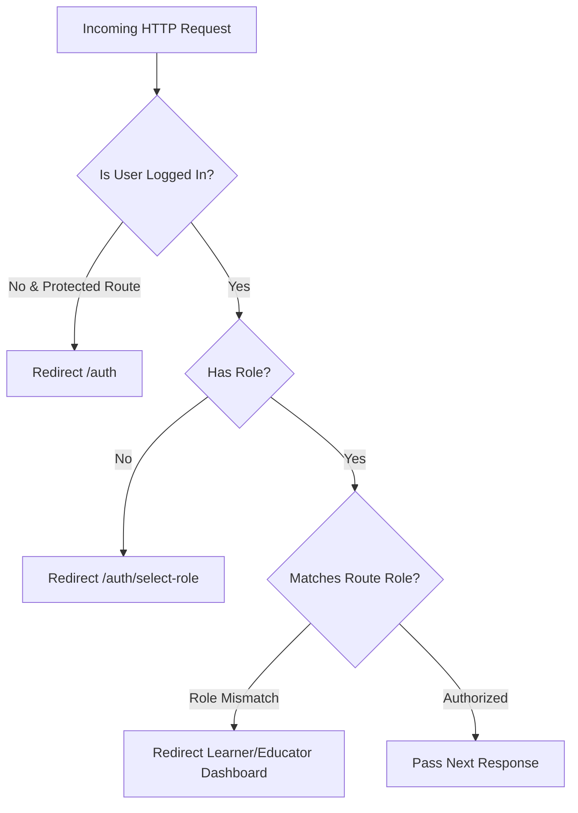

# 📐 Software Design Patterns Documentation (Full Version)
**Project:** Skill Verse — LMS with Intelligent Task Planner  
**Course:** CSE 327 Software Engineering | North South University  
**Authors:** Group #12 (Nafiz Imtiaz & Mahadi Hasan Nayan)

---

## 📌 Executive Summary

This document presents a comprehensive analysis of the **10 Software Design Patterns** implemented throughout the **Skill Verse LMS** codebase. The patterns are categorized according to classic Gang of Four (GoF) and Modern Architectural conventions into:
- **Creational Patterns** (Factory Method, Singleton)
- **Structural Patterns** (Facade, Decorator/Wrapper, Provider/Context)
- **Behavioral Patterns** (Strategy, State, Observer, Chain of Responsibility)
- **Architectural Patterns** (Repository)

---

## 📑 Summary Matrix

| # | Pattern Name | Category | Primary Files | Key Responsibility |
|---|---|---|---|---|
| 1 | **Factory Method** | Creational | [`utils/supabase/client.ts`](file:///c:/Users/Nafiz%20Imtiaz/Desktop/lms_with_intelligent_task_planner-master/utils/supabase/client.ts)<br>[`utils/supabase/server.ts`](file:///c:/Users/Nafiz%20Imtiaz/Desktop/lms_with_intelligent_task_planner-master/utils/supabase/server.ts) | Encapsulates client vs server Supabase object creation. |
| 2 | **Singleton** | Creational | [`utils/supabase/client.ts`](file:///c:/Users/Nafiz%20Imtiaz/Desktop/lms_with_intelligent_task_planner-master/utils/supabase/client.ts)<br>[`lib/google-calendar.ts`](file:///c:/Users/Nafiz%20Imtiaz/Desktop/lms_with_intelligent_task_planner-master/lib/google-calendar.ts) | Maintains a single client bundle connection instance across component renders. |
| 3 | **Observer** | Behavioral | [`app/learner/canvas/assignments/page.tsx`](file:///c:/Users/Nafiz%20Imtiaz/Desktop/lms_with_intelligent_task_planner-master/app/learner/canvas/assignments/page.tsx#L62-L87)<br>[`hooks/use-speech-to-text.ts`](file:///c:/Users/Nafiz%20Imtiaz/Desktop/lms_with_intelligent_task_planner-master/hooks/use-speech-to-text.ts) | Subscribes UI components to database changes and speech event streams. |
| 4 | **Strategy** | Behavioral | [`components/ai-teaching-assistant.tsx`](file:///c:/Users/Nafiz%20Imtiaz/Desktop/lms_with_intelligent_task_planner-master/components/ai-teaching-assistant.tsx)<br>[`utils/file-parser.ts`](file:///c:/Users/Nafiz%20Imtiaz/Desktop/lms_with_intelligent_task_planner-master/utils/file-parser.ts) | Switches algorithms dynamically based on mode or file type at runtime. |
| 5 | **State** | Behavioral | [`app/api/ai/interview/route.ts`](file:///c:/Users/Nafiz%20Imtiaz/Desktop/lms_with_intelligent_task_planner-master/app/api/ai/interview/route.ts#L138-L161) | Transitions AI behavior through interview stages (`OPENING` → `ONGOING` → `LATE` → `CLOSING`). |
| 6 | **Facade** | Structural | [`components/ai-teaching-assistant.tsx`](file:///c:/Users/Nafiz%20Imtiaz/Desktop/lms_with_intelligent_task_planner-master/components/ai-teaching-assistant.tsx)<br>[`lib/canvas-api.ts`](file:///c:/Users/Nafiz%20Imtiaz/Desktop/lms_with_intelligent_task_planner-master/lib/canvas-api.ts) | Provides a unified interface hiding multi-endpoint REST and AI API complexity. |
| 7 | **Provider / Context** | Structural | [`components/auth-context.tsx`](file:///c:/Users/Nafiz%20Imtiaz/Desktop/lms_with_intelligent_task_planner-master/components/auth-context.tsx) | Injects authentication state and methods down the component tree without prop drilling. |
| 8 | **Decorator / Wrapper** | Structural | [`components/learner-layout.tsx`](file:///c:/Users/Nafiz%20Imtiaz/Desktop/lms_with_intelligent_task_planner-master/components/learner-layout.tsx)<br>[`components/educator-layout.tsx`](file:///c:/Users/Nafiz%20Imtiaz/Desktop/lms_with_intelligent_task_planner-master/components/educator-layout.tsx) | Wraps raw view components with sidebar navigation, header, and auth enforcement. |
| 9 | **Chain of Responsibility** | Behavioral | [`middleware.ts`](file:///c:/Users/Nafiz%20Imtiaz/Desktop/lms_with_intelligent_task_planner-master/middleware.ts) | Sequentially evaluates authentication, user roles, and route permissions per request. |
| 10 | **Repository** | Architectural | [`app/api/tasks/route.ts`](file:///c:/Users/Nafiz%20Imtiaz/Desktop/lms_with_intelligent_task_planner-master/app/api/tasks/route.ts)<br>[`app/api/canvas/courses/route.ts`](file:///c:/Users/Nafiz%20Imtiaz/Desktop/lms_with_intelligent_task_planner-master/app/api/canvas/courses/route.ts) | Encapsulates database queries behind standardized REST API handlers. |

---

## 1. Factory Method Pattern (Creational)

### 📌 Intent
Defines an interface or function for creating objects, allowing subclasses or module functions to decide which class/instance to instantiate based on execution context (e.g., Browser vs Server).

### 🛠️ Implementation Details
In Next.js 15 App Router, Supabase client initialization differs depending on execution context:
- **Browser Context**: Needs `createBrowserClient` with client environment variables.
- **Server Context**: Needs `createServerClient` with asynchronous Next.js cookie handling (`cookies()`).

Both implement a unified `createClient()` interface factory function.

### 📐 Class Diagram


### 💻 Code Snippets

**Browser Factory — [`utils/supabase/client.ts`](file:///c:/Users/Nafiz%20Imtiaz/Desktop/lms_with_intelligent_task_planner-master/utils/supabase/client.ts#L1-L10)**
```typescript
import { createBrowserClient } from '@supabase/ssr'

export function createClient() {
  return createBrowserClient(
    process.env.NEXT_PUBLIC_SUPABASE_URL!,
    process.env.NEXT_PUBLIC_SUPABASE_PUBLISHABLE_KEY!
  )
}
```

**Server Factory — [`utils/supabase/server.ts`](file:///c:/Users/Nafiz%20Imtiaz/Desktop/lms_with_intelligent_task_planner-master/utils/supabase/server.ts#L1-L29)**
```typescript
import { createServerClient } from '@supabase/ssr'
import { cookies } from 'next/headers'

export async function createClient() {
  const cookieStore = await cookies()

  return createServerClient(
    process.env.NEXT_PUBLIC_SUPABASE_URL!,
    process.env.NEXT_PUBLIC_SUPABASE_PUBLISHABLE_KEY!,
    {
      cookies: {
        getAll() {
          return cookieStore.getAll()
        },
        setAll(cookiesToSet) {
          try {
            cookiesToSet.forEach(({ name, value, options }) =>
              cookieStore.set(name, value, options)
            )
          } catch {
            // Ignored if called from Server Component
          }
        },
      },
    }
  )
}
```

---

## 2. Singleton Pattern (Creational)

### 📌 Intent
Ensures a class or client instance has only one global instance throughout the user session and provides a global access point to it.

### 🛠️ Implementation Details
- `createBrowserClient` internally memoizes and reuses a single connection instance within the browser window runtime to avoid redundant connection overhead.
- `initGoogleCalendarService` initializes a single `GoogleCalendarService` instance per user session, preventing multiple OAuth authentication handshakes.

### 💻 Code Snippet — [`lib/google-calendar.ts`](file:///c:/Users/Nafiz%20Imtiaz/Desktop/lms_with_intelligent_task_planner-master/lib/google-calendar.ts#L320-L340)
```typescript
export async function initGoogleCalendarService(): Promise<GoogleCalendarService | null> {
  const supabase = await createClient()
  const { data: { user } } = await supabase.auth.getUser()

  if (!user) return null

  const { data: connection } = await supabase
    .from('calendar_sync_settings')
    .select('access_token, refresh_token')
    .eq('user_id', user.id)
    .single()

  if (!connection?.access_token || !connection?.refresh_token) {
    return null
  }

  return new GoogleCalendarService(connection.access_token, connection.refresh_token)
}
```

---

## 3. Observer Pattern (Behavioral)

### 📌 Intent
Defines a one-to-many dependency between objects so that when one object changes state (e.g., database update, speech recognition event, deadline timer), all its dependents are notified automatically.

### 🛠️ Implementation Details
1. **Supabase Realtime WebSockets**: The React client subscribes to `postgres_changes` on the `canvas_assignments` table. When an assignment row is updated or inserted in PostgreSQL, Supabase notifies the client subscriber, which automatically calls `fetchData()`.
2. **Web Speech API**: `useSpeechToText` attaches callbacks (`onresult`, `onend`, `onerror`) to the browser's `SpeechRecognition` instance.

### 📐 Sequence Diagram


### 💻 Code Snippet — [`app/learner/canvas/assignments/page.tsx`](file:///c:/Users/Nafiz%20Imtiaz/Desktop/lms_with_intelligent_task_planner-master/app/learner/canvas/assignments/page.tsx#L62-L87)
```typescript
  // Real-time subscription for canvas_assignments updates
  useEffect(() => {
    const supabase = createClient()
    
    // Subscribe to changes in canvas_assignments table
    const channel = supabase
      .channel('canvas_assignments_changes')
      .on(
        'postgres_changes',
        {
          event: '*', // Listen to INSERT, UPDATE, DELETE
          schema: 'public',
          table: 'canvas_assignments'
        },
        (payload) => {
          console.log('Canvas assignment changed:', payload)
          // Refresh data when any assignment is updated
          fetchData()
        }
      )
      .subscribe()

    // Cleanup subscription on unmount
    return () => {
      supabase.removeChannel(channel)
    }
  }, [selectedCourse, statusFilter, submittedFilter])
```

---

## 4. Strategy Pattern (Behavioral)

### 📌 Intent
Enables selecting an algorithm or execution strategy at runtime without altering the context that uses it.

### 🛠️ Implementation Details
- **AI Teaching Assistant** (`AITeachingAssistant`): Accepts a `mode` prop (`"course-outline" | "content-enhancer" | "assessment-generator" | "student-insights"`). Based on `mode`, it selects different API endpoints, parameters, system prompts, and UI render strategies.
- **File Parser** (`extractTextFromFile`): Evaluates file type (`image/*` vs text) and dispatches to the appropriate parsing strategy (`extractTextFromImage` via Tesseract OCR).

### 📐 Strategy Architecture


### 💻 Code Snippet — [`components/ai-teaching-assistant.tsx`](file:///c:/Users/Nafiz%20Imtiaz/Desktop/lms_with_intelligent_task_planner-master/components/ai-teaching-assistant.tsx#L23-L80)
```typescript
interface AITeachingAssistantProps {
  mode: "course-outline" | "content-enhancer" | "assessment-generator" | "student-insights"
  onClose?: () => void
  onApply?: (data: any) => void
  initialData?: any
}

export function AITeachingAssistant({ mode, initialData }: AITeachingAssistantProps) {
  // Strategy execution based on mode parameter
  const handleGenerate = () => {
    switch (mode) {
      case "course-outline":
        return handleGenerateCourseOutline()
      case "content-enhancer":
        return handleEnhanceContent()
      case "assessment-generator":
        return handleGenerateAssessment()
      case "student-insights":
        return handleFetchInsights()
    }
  }
}
```

---

## 5. State Pattern (Behavioral)

### 📌 Intent
Allows an object to alter its behavior when its internal state changes, making it appear as if the object changed its class.

### 🛠️ Implementation Details
In the **AI Interview Engine** ([`app/api/ai/interview/route.ts`](file:///c:/Users/Nafiz%20Imtiaz/Desktop/lms_with_intelligent_task_planner-master/app/api/ai/interview/route.ts#L138-L161)), the interview session transitions through explicit stages based on the number of completed questions (`questionCount`):
1. `OPENING` — Welcomes the candidate and asks introductory background questions.
2. `ONGOING` — Asks deep technical and domain-specific questions based on the job description.
3. `LATE` — Evaluates problem-solving and scenario-based responses.
4. `CLOSING` — Wraps up professionally and generates comprehensive performance feedback.

### 💻 Code Snippet — [`app/api/ai/interview/route.ts`](file:///c:/Users/Nafiz%20Imtiaz/Desktop/lms_with_intelligent_task_planner-master/app/api/ai/interview/route.ts#L138-L161)
```typescript
const questionCount = conversationHistory.filter((msg: any) => msg.role === "assistant").length

let stageInstruction = ""
if (questionCount >= 7) {
  stageInstruction = "\n\nINTERVIEW STAGE: CLOSING - This should be your final question or wrap up the interview professionally. Thank the candidate and indicate the interview is complete."
} else if (questionCount >= 5) {
  stageInstruction = "\n\nINTERVIEW STAGE: LATE - You're near the end. Ask 1-2 more meaningful questions before wrapping up."
} else {
  stageInstruction = "\n\nINTERVIEW STAGE: ONGOING - Continue with relevant questions based on the job requirements and previous answers."
}

// System prompt dynamically incorporates the current state instruction
const systemPrompt = `You are a professional technical interviewer... ${stageInstruction}`
```

---

## 6. Facade Pattern (Structural)

### 📌 Intent
Provides a unified, high-level interface to a set of interfaces in a subsystem, making the subsystem easier to use.

### 🛠️ Implementation Details
- **`CanvasAPIService`**: Encapsulates multiple complex low-level Canvas REST endpoints (`/api/v1/users/self`, `/api/v1/courses`, `/api/v1/announcements`, `/api/v1/users/self/enrollments?include[]=grades`) into single high-level clean method calls like `getCourses()`, `getAllAnnouncements()`, and `getEnrollments()`.

### 💻 Code Snippet — [`lib/canvas-api.ts`](file:///c:/Users/Nafiz%20Imtiaz/Desktop/lms_with_intelligent_task_planner-master/lib/canvas-api.ts#L72-L105)
```typescript
export class CanvasAPIService {
  private canvasUrl: string
  private accessToken: string
  private baseUrl: string

  constructor(config: CanvasConfig) {
    this.canvasUrl = config.canvasUrl.replace(/\/$/, '')
    this.accessToken = config.accessToken
    this.baseUrl = `${this.canvasUrl}/api/v1`
  }

  // Facade method hiding HTTP headers, bearer tokens, and endpoint formatting
  private async request<T>(endpoint: string, options: RequestInit = {}): Promise<T> {
    const url = `${this.baseUrl}${endpoint}`
    const response = await fetch(url, {
      ...options,
      headers: {
        'Authorization': `Bearer ${this.accessToken}`,
        'Content-Type': 'application/json',
        ...options.headers,
      },
    })
    return response.json()
  }

  // Simplified high-level facade interface used by application
  async getCourses(): Promise<CanvasCourse[]> {
    return this.request<CanvasCourse[]>('/courses?include[]=term&per_page=100')
  }
}
```

---

## 7. Provider / Context Pattern (Structural / Dependency Injection)

### 📌 Intent
Provides a way to share values (such as authentication state and user details) between components without having to explicitly pass a prop through every level of the component tree.

### 🛠️ Implementation Details
`AuthProvider` wraps the React root tree and injects `user`, `isLoading`, `signIn`, `signUp`, and `signOut` into any child component using the custom `useAuth()` hook.

### 💻 Code Snippet — [`components/auth-context.tsx`](file:///c:/Users/Nafiz%20Imtiaz/Desktop/lms_with_intelligent_task_planner-master/components/auth-context.tsx#L24-L112)
```typescript
const AuthContext = createContext<AuthContextType | undefined>(undefined)

export function AuthProvider({ children }: { children: React.ReactNode }) {
  const [user, setUser] = useState<User | null>(null)
  const [isLoading, setIsLoading] = useState(true)

  return (
    <AuthContext.Provider value={{ user, isLoading, signIn, signUp, signOut }}>
      {children}
    </AuthContext.Provider>
  )
}

export function useAuth() {
  const context = useContext(AuthContext)
  if (context === undefined) {
    throw new Error("useAuth must be used within an AuthProvider")
  }
  return context
}
```

---

## 8. Decorator / Wrapper Pattern (Structural)

### 📌 Intent
Attaches additional responsibilities or layout capabilities to an object/component dynamically without altering its core structure.

### 🛠️ Implementation Details
`LearnerLayout` and `EducatorLayout` act as structural decorators. They accept raw page components (`children`) and dynamically wrap them with sidebar navigation, mobile drawer toggles, theme styling, and header user controls.

### 💻 Code Snippet — [`components/learner-layout.tsx`](file:///c:/Users/Nafiz%20Imtiaz/Desktop/lms_with_intelligent_task_planner-master/components/learner-layout.tsx#L24-L50)
```typescript
interface LearnerLayoutProps {
  children: React.ReactNode
}

export function LearnerLayout({ children }: LearnerLayoutProps) {
  return (
    <div className="flex h-screen bg-background">
      {/* Sidebar Decorator */}
      <aside className="hidden md:flex flex-col w-64 border-r-4 border-border bg-main/5">
        <NavItems />
      </aside>

      {/* Main Decorated Content */}
      <main className="flex-1 overflow-y-auto">
        {children}
      </main>
    </div>
  )
}
```

---

## 9. Chain of Responsibility Pattern (Behavioral)

### 📌 Intent
Avoids coupling the sender of a request to its receiver by giving more than one object a chance to handle the request. Passes the request along a chain until an object handles or redirects it.

### 🛠️ Implementation Details
In Next.js middleware ([`middleware.ts`](file:///c:/Users/Nafiz%20Imtiaz/Desktop/lms_with_intelligent_task_planner-master/middleware.ts#L4-L109)), every incoming HTTP request passes through a sequential validation chain:
1. **Authentication Guard**: Is user logged in? If not and route is protected → redirect to `/auth`.
2. **Role Verification**: Does user profile have a role? If missing → redirect to `/auth/select-role`.
3. **Role Authorization**: Is a learner accessing `/educator/*` or educator accessing `/learner/*`? If mismatched → redirect to correct role dashboard.
4. **Auth Page Redirection**: Is an authenticated user accessing `/auth`? → redirect to dashboard.

### 📐 Chain Flow Diagram


### 💻 Code Snippet — [`middleware.ts`](file:///c:/Users/Nafiz%20Imtiaz/Desktop/lms_with_intelligent_task_planner-master/middleware.ts#L54-L89)
```typescript
  // 1. Authentication Check
  if (!user && isProtectedRoute) {
    const redirectUrl = new URL('/auth', request.url)
    redirectUrl.searchParams.set('redirectTo', path)
    return NextResponse.redirect(redirectUrl)
  }

  // 2. Role Check & Authorization Check
  if (user && (isEducatorRoute || isLearnerRoute)) {
    const { data: profile } = await supabase
      .from('profiles')
      .select('role')
      .eq('id', user.id)
      .single()

    if (!profile?.role) {
      return NextResponse.redirect(new URL('/auth/select-role', request.url))
    }

    if (isEducatorRoute && profile.role !== 'educator') {
      return NextResponse.redirect(new URL('/learner/dashboard', request.url))
    }

    if (isLearnerRoute && profile.role !== 'learner') {
      return NextResponse.redirect(new URL('/educator/dashboard', request.url))
    }
  }

  return supabaseResponse
```

---

## 10. Repository Pattern (Architectural)

### 📌 Intent
Mediates between the domain and data mapping layers using a collection-like interface for accessing domain objects, isolating database access logic from presentation components.

### 🛠️ Implementation Details
Next.js Server API routes (`app/api/*`) encapsulate Supabase PostgreSQL data queries. Client components never perform raw database queries directly for task creation or updates; instead, they interact through standardized API endpoints (`/api/tasks`, `/api/canvas/courses`).

### 💻 Code Snippet — [`app/api/tasks/route.ts`](file:///c:/Users/Nafiz%20Imtiaz/Desktop/lms_with_intelligent_task_planner-master/app/api/tasks/route.ts#L19-L37)
```typescript
export async function GET() {
  const supabase = await createClient()
  const { data: { user }, error: authError } = await supabase.auth.getUser()
  
  if (authError || !user) {
    return NextResponse.json({ error: 'Unauthorized' }, { status: 401 })
  }

  // Repository data retrieval abstraction
  const { data: tasks, error } = await supabase
    .from('learner_tasks')
    .select('*, course:courses(id, title)')
    .eq('learner_id', user.id)
    .order('created_at', { ascending: false })

  return NextResponse.json({ tasks })
}
```

---

## 🎯 Presentation Conclusion

By employing these **10 Design Patterns**, the **Skill Verse LMS** architecture achieves:
- **High Cohesion & Low Coupling** (Repository, Facade, Factory Method)
- **Extensibility & Clean Code** (Strategy, State, Observer)
- **Robust Security & Type Safety** (Chain of Responsibility Middleware, Provider Context)
